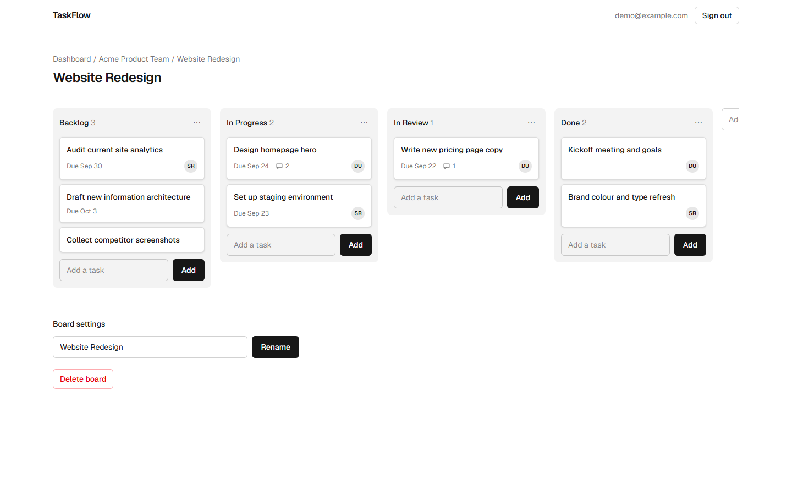
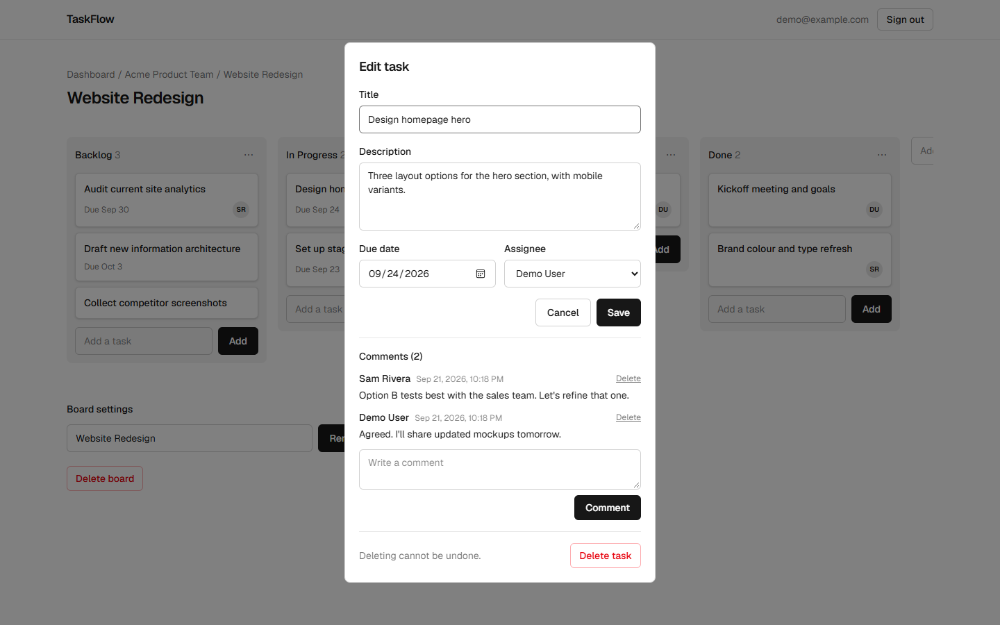
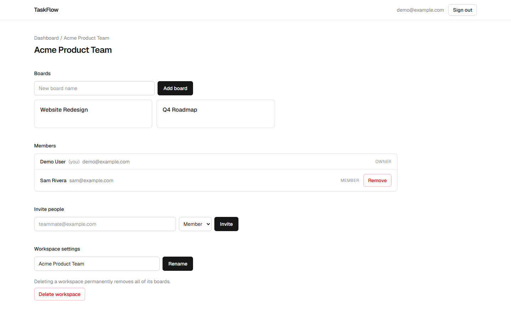

# TaskFlow

A collaborative Kanban-style project tracker. Teams organize work into workspaces and boards, drag task cards between lists, assign people, set due dates, and discuss work in comments.

**Live demo:** [taskflow-seven-rose.vercel.app](https://taskflow-seven-rose.vercel.app/) &nbsp;·&nbsp; **Demo login:** `demo@example.com` / `demo-password-123` (a shared, resettable account)



<p>
  
  
</p>

## Features

- **Accounts:** sign up and log in with email and password (bcrypt-hashed, JWT sessions).
- **Workspaces and boards:** create workspaces, group boards inside them, and rename or delete either.
- **Kanban lists and tasks:** add lists and tasks, then drag tasks between lists or reorder them. Works with mouse, touch and keyboard.
- **Task details:** description, due date, assignee (any workspace member) and a threaded comment log.
- **Collaboration:** invite people with single-use links, manage members, and let anyone leave a workspace.
- **Roles:** owner, admin and member, each with clearly scoped permissions enforced on the server.
- **Responsive:** works on phones, with columns that scroll sideways.

## Tech stack

| Area | Choice |
| --- | --- |
| Framework | Next.js 16 (App Router, Server Actions, Route Handlers) + React 19 |
| Language | TypeScript |
| Styling | Tailwind CSS 4 |
| Database | PostgreSQL (Neon) with Prisma ORM |
| Auth | Auth.js (NextAuth v5), credentials provider, bcrypt |
| Drag and drop | dnd-kit |
| Validation | Zod 4 |

## Engineering notes

A few decisions worth calling out:

- **Authorization lives on the server, per action.** Every Server Action re-derives the workspace from the record being touched (a task leads to its list, its board, its workspace) and checks membership and role. Nothing trusts an id sent by the client. Non-members get a 404 instead of a 403, so ids can't be probed.
- **Drag-and-drop is optimistic, with rollback.** The UI moves the card instantly and persists in the background. If the server rejects the move (for example, a neighbouring card was deleted elsewhere), the board rolls back, shows a message and refreshes from the server.
- **One write per move.** Task and list order use float positions: a dropped card takes the midpoint between its neighbours, so a move updates a single row. When repeated midpoints exhaust float precision, the list is renumbered automatically.
- **Invitations are credentials.** Invite links carry a 256-bit random token, expire after seven days, are single-use, and only work for the invited email address. The post-login `?next=` redirect only accepts same-site paths.
- **Next.js 16 conventions.** Route protection uses `proxy.ts` (the new name for middleware). The Auth.js config is split so the proxy never loads Prisma or bcrypt.
- **Lazy-loaded comments.** Comments load through a Route Handler when a task opens, instead of bloating every board payload.

## Getting started

Requirements: Node.js 20+ and a PostgreSQL database (a free [Neon](https://neon.tech) project works well).

```bash
npm install
cp .env.example .env         # fill in the values below
npx prisma migrate dev       # create the tables
npm run db:seed              # optional: load demo data
npm run dev                  # http://localhost:3000
```

### Environment variables

| Variable | Purpose |
| --- | --- |
| `DATABASE_URL` | Connection used by the app. On Neon in production, use the **pooled** string (host contains `-pooler`). |
| `DIRECT_URL` | Direct, non-pooled connection used only by Prisma migrations. Locally it can equal `DATABASE_URL`. |
| `AUTH_SECRET` | Secret for signing sessions. Generate one with `npx auth secret`. |
| `AUTH_TRUST_HOST` | Set to `true` when running a production build anywhere except Vercel, including `npm start` locally. |
| `DEMO_PASSWORD` | Optional. Overrides the demo account password used by `npm run db:seed`. |

### Scripts

| Command | What it does |
| --- | --- |
| `npm run dev` | Start the development server |
| `npm run build` / `npm start` | Production build and server |
| `npm run lint` | Run ESLint |
| `npm run db:migrate` | Apply committed migrations (`prisma migrate deploy`) |
| `npm run db:seed` | Create or reset the demo account and workspace (safe to re-run) |

## Deploying to Vercel with Neon

1. **Push the repository to GitHub.**
2. **Create a Neon project**, ideally with a separate `production` branch so demo data and development data stay apart. From the **Connect** dialog copy two strings: the **pooled** one (for `DATABASE_URL`) and the **direct** one (for `DIRECT_URL`).
3. **Import the repo in Vercel.** The Next.js preset works as is. Set the **Build Command** to:
   ```
   prisma migrate deploy && next build
   ```
   so committed migrations are applied on every deploy.
4. **Add environment variables** in Vercel: `DATABASE_URL` (pooled), `DIRECT_URL` (direct) and `AUTH_SECRET` (generate a fresh value; don't reuse your local one). `AUTH_TRUST_HOST` isn't needed on Vercel. If you see prepared-statement errors with the pooled connection, append `&pgbouncer=true` to `DATABASE_URL`.
5. **Deploy**, then optionally seed demo data by running `npm run db:seed` locally with `DATABASE_URL` and `DIRECT_URL` pointing at the production database. Set `DEMO_PASSWORD` first if you don't want the default password public.
6. **Check Deployment Protection** (Settings, Deployment Protection) so the production URL opens without a Vercel login, then link it at the top of this README.

## Project structure

```
prisma/               schema, migrations, seed script
src/
  app/
    (auth)/           login, signup, invitation pages
    (app)/            authenticated shell: dashboard, workspaces, boards
    actions/          Server Actions (auth, workspaces, boards, lists, tasks, comments, ...)
    api/              Auth.js handlers and the task comments endpoint
  components/         UI, including the drag-and-drop board
  lib/                authorization helpers, validation schemas, shared types
  auth.ts             Auth.js configuration (credentials provider)
  proxy.ts            route protection
```

## Limitations and ideas

- Invitations are shared as links; there's no email delivery yet.
- Changes from other people appear on refresh, not live. Real-time sync (WebSockets or server-sent events) is a natural next step.
- No automated test suite yet. The server-side authorization helpers are the first place I'd add tests.
- Login isn't rate limited.
- The database already has the tables needed for OAuth sign-in (GitHub, Google); the UI for it isn't built.
